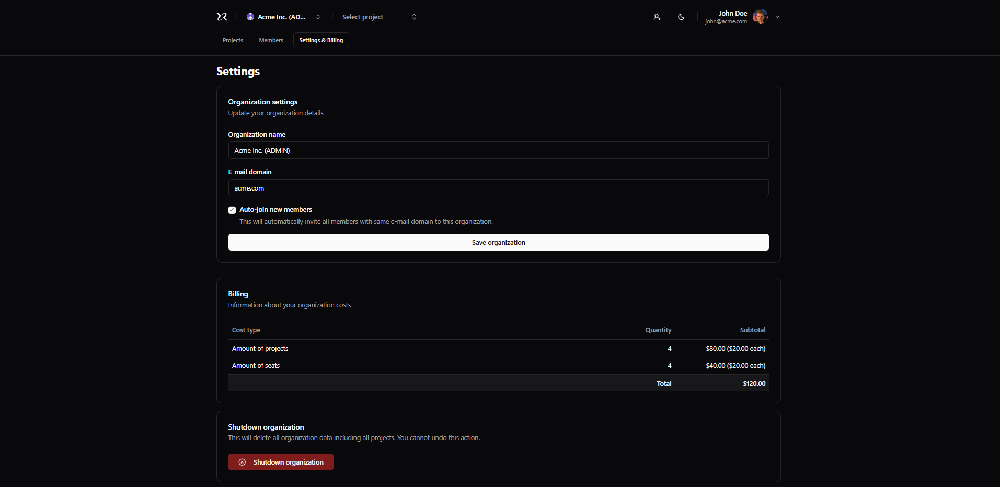

# next-saas-rbac

Saas multi tenant

# Next.js SaaS + RBAC

This project contains all the necessary boilerplate to setup a multi-tenant SaaS with Next.js including authentication and RBAC authorization.

Note: I have standardized all my commits on GitHub in English to demonstrate my proficiency as an English speaker.

## Features

### Authentication

- [ ] It should be able to authenticate using e-mail & password;
- [ ] It should be able to authenticate using Github account;
- [ ] It should be able to recover password using e-mail;
- [ ] It should be able to create an account (e-mail, name and password);

### Organizations

- [ ] It should be able to create a new organization;
- [ ] It should be able to get organizations to which the user belongs;
- [ ] It should be able to update an organization;
- [ ] It should be able to shutdown an organization;
- [ ] It should be able to transfer organization ownership;

### Invites

- [ ] It should be able to invite a new member (e-mail, role);
- [ ] It should be able to accept an invite;
- [ ] It should be able to revoke a pending invite;

### Members

- [ ] It should be able to get organization members;
- [ ] It should be able to update a member role;

### Projects

- [ ] It should be able to get projects within a organization;
- [ ] It should be able to create a new project (name, url, description);
- [ ] It should be able to update a project (name, url, description);
- [ ] It should be able to delete a project;

### Billing

- [ ] It should be able to get billing details for organization ($20 per project / $10 per member excluding billing role);

## RBAC

Roles & permissions.

### Roles

- Owner (count as administrator)
- Administrator
- Member
- Billing (one per organization)
- Anonymous

### Permissions table

|                          | Administrator | Member | Billing | Anonymous |
| ------------------------ | ------------- | ------ | ------- | --------- |
| Update organization      | ✅            | ❌     | ❌      | ❌        |
| Delete organization      | ✅            | ❌     | ❌      | ❌        |
| Invite a member          | ✅            | ❌     | ❌      | ❌        |
| Revoke an invite         | ✅            | ❌     | ❌      | ❌        |
| List members             | ✅            | ✅     | ✅      | ❌        |
| Transfer ownership       | ⚠️            | ❌     | ❌      | ❌        |
| Update member role       | ✅            | ❌     | ❌      | ❌        |
| Delete member            | ✅            | ⚠️     | ❌      | ❌        |
| List projects            | ✅            | ✅     | ✅      | ❌        |
| Create a new project     | ✅            | ✅     | ❌      | ❌        |
| Update a project         | ✅            | ⚠️     | ❌      | ❌        |
| Delete a project         | ✅            | ⚠️     | ❌      | ❌        |
| Get billing details      | ✅            | ❌     | ✅      | ❌        |
| Export billing details   | ✅            | ❌     | ✅      | ❌        |

> ✅ = allowed
> ❌ = not allowed
> ⚠️ = allowed w/ conditions

#### Conditions

- Only owners may transfer organization ownership;
- Only administrators and project authors may update/delete the project;
- Members can leave their own organization;

this next image was created using parallel route and interception routes on next

## Technologies

### Back-end:

- **Turborepo**: A build and monorepo management tool designed to optimize the development process in projects.  
- **CASL**: A JavaScript library for implementing rule-based access control.  
- **Zod**: A TypeScript library for data validation and schema definition.  
- **Prisma**: A modern object-relational mapper (ORM) for Node.js and TypeScript that simplifies interaction with SQL databases like PostgreSQL, MySQL, and SQLite.  
- **Bcryptjs**: A JavaScript library for password hashing.  
- **Fakerjs**: A JavaScript library used to generate random mock data.  
- **Fastify**: A web framework for Node.js focused on performance, low resource consumption, and extensibility.  
- **Fastify Swagger UI**: A tool that automatically generates and displays API documentation for Fastify projects using Swagger UI.  

---

### Front-end:

- **Shadcn/ui**: A React component library based on Radix UI and styled with Tailwind CSS.  
- **KY**: A lightweight JavaScript library for making HTTP requests, serving as a simpler alternative to `fetch` and `axios`.  
- **cookies-next**: A Next.js library that simplifies cookie management on both the client and server sides.  
- **next-themes**: A Next.js library that makes implementing dynamic themes, such as light and dark modes, easy.  
- **TanStack React Query**: A library for managing asynchronous state in React applications, focusing on handling HTTP requests and the lifecycle of data from APIs.  

